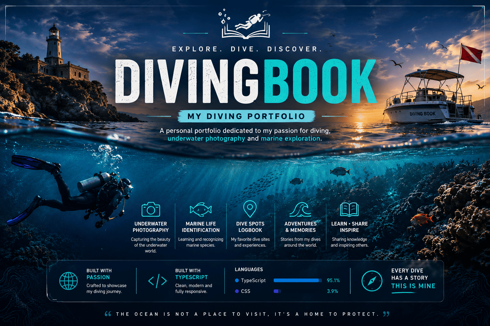

<p align="center">
  
</p>

<p align="center">


</p>

<h1 align="center">🌊 Book Plongée Portfolio – Ocean Story Scroll</h1>

<p align="center">
  <strong>An immersive underwater portfolio built with React, TypeScript and Vite.</strong>
</p>

<p align="center">
  Explore the ocean through cinematic scrolling, marine life identification and underwater storytelling.
</p>

---

#  About

DivingBook is an immersive web experience inspired by modern editorial websites and interactive documentaries.

The project combines cinematic scrolling, smooth animations and underwater storytelling to showcase diving adventures, marine biodiversity and ocean conservation.

Everything is built with a modern React architecture and optimized for a fluid browsing experience.

---

# Features

-  Cinematic scrolling experience
-  Marine species encyclopedia
-  Underwater photography gallery
-  Dive spot explorer
-  Personal diving logbook
-  Immersive background videos
-  Smooth animations
-  Responsive design
-  Fast loading with Vite

---

# Tech Stack

| Technology | Usage |
|------------|-------|
| React | Frontend |
| TypeScript | Main language |
| Vite | Build tool |
| CSS3 | Styling |
| Tailwind CSS | Utility-first styling |
| Framer Motion | Animations |
| Radix UI | Accessible UI components |

---

# Installation

```bash
git clone https://github.com/EnzoSCH1/Portfolio_DivingBook.git

cd Portfolio_DivingBook

npm install

npm run dev
```

Open

```
http://localhost:5173
```

---

# Project Structure

```
src
├── components
├── pages
├── hooks
├── assets
├── styles
└── lib

public
├── images
├── videos
└── icons
```

---

# Roadmap

- [x] Hero cinematic section
- [x] Ocean storytelling
- [x] Responsive layout
- [x] Marine life pages
- [ ] Interactive world dive map
- [ ] Advanced search
- [ ] Favorites system
- [ ] Progressive Web App
- [ ] Multi-language support

---

# GitHub Stats

- **Language:** TypeScript (95.1%)
- **CSS:** 3.9%
- **Framework:** React
- **Build Tool:** Vite

---

# 🤝 Contributing

Contributions are welcome.

Feel free to open an Issue or submit a Pull Request.

---

<div align="center">

Made with ❤️ by **Enzo SCH**

*"Every dive has a story."*

</div>
---

> "La mer commence ici. Protégeons-la ensemble."
